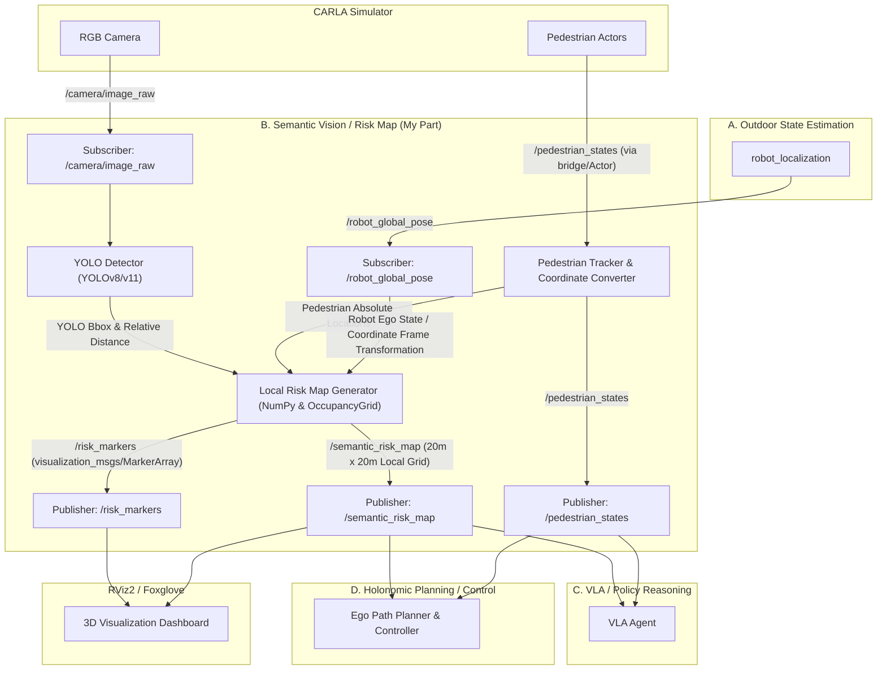
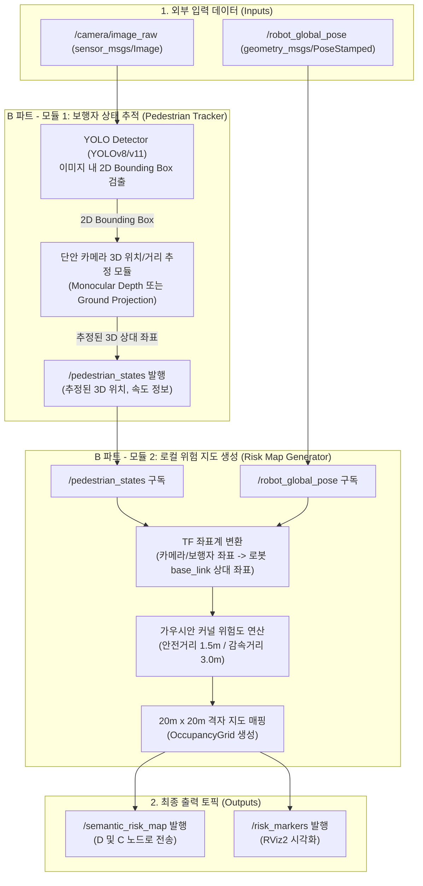

# 3D 매핑 및 Risk Map (담당 파트 B) 실행 계획 & TODO

이 문서는 **Outdoor VLA Robot Project**의 실행 계획 중 **B. Semantic Vision / Risk Map (3D 매핑 및 위험성 지도 생성)** 파트 담당자가 수행해야 할 작업을 정리한 체크리스트 및 가이드라인입니다.

---

## 📌 역할 개요 및 목표
* **역할**: **B. Semantic Vision / Risk Map**
* **목표**: RGB 카메라 및 보행자 Actor 정보를 기반으로 사람, 장애물, 위험구역을 인식하고 실시간 **Local Risk Map**을 생성합니다.
* **최종 센서/환경 구성**: LiDAR 및 Depth 센서 없이 (**LiDAR/Depth-free**) RGB Camera + IMU + GPS/GNSS와 CARLA 시뮬레이터를 활용해 실외 시맨틱 내비게이션을 구현합니다.

---

## 🏗️ 시스템 아키텍처 (System Architecture)

이 파트(B)의 내부 데이터 처리 흐름 및 외부 노드(A, C, D) 간의 토픽 인터페이스 구조입니다.



---

## 🔄 데이터 처리 상세 플로차트 (Detailed Data Processing Flowchart)

보행자의 실제 위치 정보(Ground Truth)를 모른다고 가정하고, **오직 단안 RGB 카메라 영상(`camera/image_raw`)만을 활용하여 사람을 검출하고 3D 위치를 추정**하는 경우의 세부 데이터 흐름도입니다.



---

## 📷 단안 RGB 카메라 기반 3D 위치 추정 기법 (LiDAR/Depth-free)

사람의 실제 위치를 모를 때, 단일 RGB 카메라로 보행자의 3D 상대 좌표 $(X, Y, Z)$를 추정하는 대표적인 3차원 투영 기법들입니다. 프로젝트 진행 시 활용할 수 있습니다.

### 1. 지면 투영 기법 (Ground Plane Projection / Homography)
* **원리**: 보행자가 항상 평평한 지면($Z_{ground} = 0$)을 딛고 서 있다고 가정합니다.
* **구현 방식**:
  1. YOLO 검출 박스의 최하단 중앙점(발 위치, $u, v$)을 추출합니다.
  2. 카메라의 내부 파라미터(Intrinsic Matrix, $K$)와 카메라가 지면으로부터 설치된 높이($h$), 틸트(Pitch) 각도를 활용하여 투영 행렬을 구성합니다.
  3. 역투영 기법을 통해 이미지 상의 발 위치 $(u, v)$를 지면 상의 3D 상대 좌표 $(X, Y, 0)$으로 변환합니다.
* **특징**: 추가적인 AI 모델 없이 가장 빠르고 안정적이지만, 지면이 평평하지 않거나 로봇이 흔들릴 때 오차가 발생할 수 있습니다.

### 2. 기하학적 크기 추정 기법 (Bounding Box Height Heuristic)
* **원리**: 일반적인 성인 보행자의 평균 키(예: 1.7m)가 일정하다고 가정하고 거리를 역산합니다.
* **구현 방식**:
  1. 이미지 상에서 YOLO가 검출한 사람의 2D 바운딩 박스 세로 픽셀 높이($h_{pixel}$)를 구합니다.
  2. 카메라의 초점거리($f_y$)와 실제 보행자 평균 키($H_{real} \approx 1.7m$)를 이용하여 카메라로부터 보행자까지의 거리 $D$를 구합니다.
     $$D = \frac{H_{real} \times f_y}{h_{pixel}}$$
  3. 이미지 중심점과의 가로 오프셋을 활용하여 상대 각도(Yaw)를 계산하고 최종 3D 좌표 $(X, Y, Z)$로 복원합니다.
* **특징**: 수식이 매우 간단하지만, 보행자가 웅크리거나 일부가 가려질 경우(Occlusion) 거리 오차가 크게 증가합니다.

### 3. 단안 깊이 추정 AI 모델 연동 (Monocular Depth Estimation)
* **원리**: 단일 RGB 이미지로부터 전체 깊이 정보를 추정하는 딥러닝 모델을 활용합니다.
* **구현 방식**:
  1. 입력 영상(`camera/image_raw`)을 Depth Anything, MiDaS 등의 경량화 모델에 통과시켜 Depth Map을 생성합니다.
  2. YOLO의 Bounding Box 중심부 영역의 Depth 값을 샘플링합니다.
  3. 카메라 내부 파라미터($K$)를 통해 $(u, v, Depth) \rightarrow (X, Y, Z)$로 3D 투영합니다.
* **특징**: 정밀한 거리 추정이 가능하지만, 추가적인 AI 모델 구동으로 인해 연산 오버헤드가 발생하여 실시간성(FPS)이 저하될 수 있으므로 주의해야 합니다.

---

## 💡 단안 RGB 카메라 단독 매핑의 실현 가능성 (Feasibility)

LiDAR나 Depth 센서가 없는 단안(Monocular) RGB 카메라만으로 지도를 작성하는 것은 **기하학적/물리적 가정**을 활용하면 충분히 가능하며, 실제 로보틱스 산업에서도 널리 쓰이는 기법입니다.

### 1. 왜 단일 RGB 카메라로 지도를 그릴 수 있을까?
단안 카메라의 가장 큰 한계는 **"이미지의 각 픽셀이 카메라로부터 얼마나 떨어져 있는지(깊이, Depth)"를 직접 알 수 없다**는 점입니다. 3차원 공간이 2차원 평면으로 투영되면서 차원이 축소되었기 때문입니다.
이를 해결하여 2D 격자 지도(`OccupancyGrid`)로 복원하기 위해 다음과 같은 기법을 적용합니다.

* **지면 평면 가정 (Ground Plane Assumption)**:
  * 로봇이 실외 광장이나 도로 같은 평평한 지면 위에서 움직인다고 가정합니다.
  * 보행자나 장애물의 '발이 닿은 바닥 점(Footpoint)'은 3차원 공간 상의 $Z_{ground} = 0$ 평면 위에 위치하게 됩니다.
  * 이 기하학적 제약 조건 덕분에, 카메라 내부 파라미터($K$)와 지면 대비 카메라 높이/각도 정보만 있으면 이미지 상의 발 좌표 $(u, v)$를 로봇 상대 좌표 $(X, Y, 0)$으로 **1대1 매핑(Homography)** 할 수 있습니다.
* **로봇의 자기 위치 추정(Pose)과의 결합**:
  * A 파트(`robot_localization`)가 발행하는 `/robot_global_pose`를 실시간으로 받아옵니다.
  * 검출된 보행자의 로봇 기준 상대 좌표 $(X_{relative}, Y_{relative})$를 로봇의 전역 좌표 기준 $(X_{global}, Y_{global})$으로 실시간 변환(TF 변환)합니다.
  * 이 글로벌 좌표들을 2D 격자 맵에 누적시키거나, 로봇 중심의 Local Costmap 상에 투영해 나감으로써 실시간으로 업데이트되는 위험 지도를 완성할 수 있습니다.

### 2. 한계점 및 보완 방법
* **지면의 요철**: 로봇이 흔들리거나(Pitch/Roll 발생) 경사로를 주행할 때 Homography 투영 오차가 발생하여 사람의 위치가 지도 상에서 튀는 현상이 생깁니다.
  * *보완*: IMU 데이터를 받아 실시간으로 카메라의 Pitch/Roll 변동량을 보정(Extrinsic Calibration 동적 업데이트)하여 투영 성능을 유지합니다.
* **카메라 사각지대**: 카메라 화각(FoV)을 벗어난 영역은 탐지할 수 없으므로 지도가 갱신되지 않습니다.
  * *보완*: 맵에 **시계열적 감쇠 필터(Decay Filter)**를 적용하여, 현재 탐지 영역 밖의 과거 데이터는 시간이 지나면서 자연스럽게 지워지거나 서서히 신뢰도를 낮추도록 설계합니다.

---

## ⚡ 실시간성(Real-time) 확보 및 최적화 전략

로봇이 실제 주행하면서 10Hz 이상의 실시간성(Real-time)을 유지하며 데이터를 계산하고 발행하기 위한 구체적인 최적화 방안입니다.

### 1. 인지 모듈 (YOLO) 최적화
* **경량 모델(Nano) 사용**: 파라미터가 큰 모델 대신 **YOLOv8n / YOLO11n (Nano)** 모델을 사용합니다.
* **가속 엔진 활용**: 일반 PyTorch `.pt` 파일을 그대로 로드하는 대신, **TensorRT** (NVIDIA GPU 환경) 또는 **ONNX Runtime**으로 변환하여 모델을 추론합니다.
  * *기대 효과*: GPU 가속 적용 시 단일 카메라 기준 추론 속도를 **30~60+ FPS** 수준으로 확보할 수 있습니다.

### 2. 3D 위치 추정 연산 최소화 (Homography 권장)
* **연산량 비교**:
  * **단안 깊이 추정 AI (Depth Anything 등)**: 추론에만 수십 ms가 소요되어 실시간 주행 중 병목의 원인이 됩니다.
  * **지면 투영 기법 (Homography)**: 행렬 곱셈 몇 번으로 3D 좌표를 계산하므로 CPU 연산 시간이 **0.1ms 이하**입니다.
* **결론**: 실시간 주행 환경에서는 **지면 투영 기법(Homography)** 또는 **바운딩 박스 크기 추정 기법**을 메인으로 사용하고, AI 기반 Depth estimation은 연구용/오프라인 검증용으로만 제한적으로 활용하는 것을 권장합니다.

### 3. Local Risk Map 생성 연산 최적화 (NumPy Vectorization)
* **연산 대상 크기**: 로봇 주변 20m x 20m(해상도 0.1m) 지도의 셀 개수는 $200 \times 200 = 40,000$개에 불과합니다.
* **Python 최적화 핵심**:
  * 파이썬의 `for` 루프를 사용해 모든 셀을 순회하며 가우시안 값을 더하면 극심한 속도 저하(수백 ms 이상 지연)가 발생합니다.
  * **NumPy 브로드캐스팅(Broadcasting) 및 행렬 연산**을 사용하여 가우시안 커널을 한 번에 지도 전체에 씌우도록 코드를 작성해야 합니다.
  * *기대 효과*: NumPy 벡터화 적용 시 보행자가 30명 이상이더라도 가우시안 위험도 연산 및 병합 시간이 **1~2ms 이하**로 줄어듭니다.

### 4. ROS2 노드 통신 병목 방지 (Callback Group)
* 단일 스레드로 구현된 ROS2 노드는 카메라 콜백 처리가 길어질 경우 센서 Pose 수신이 지연될 수 있습니다.
* **MultiThreadedExecutor**와 **ReentrantCallbackGroup**을 활용하여 센서 데이터 수신, YOLO 추론, 맵 생성 작업이 병렬적으로 처리되도록 설계해야 합니다.

---

## ⏱️ 예상 동작 주파수(Hz) 및 연산 Latency 분석

앞서 제시한 **최적화 전략(YOLO Nano + TensorRT + Homography 투영 + NumPy 연산)**을 적용했을 때, 일반적인 로봇용 개발 PC(예: RTX 3060 / 4060 Mobile급 GPU 탑재 노트북 또는 Jetson Orin NX) 기준 예상 처리 시간과 발행 주파수입니다.

### 1. 각 모듈별 예상 소요 시간 (Latency)
* **카메라 이미지 입력 및 ROS2 디코딩**: ~2 ms
* **YOLOv8n/YOLO11n 추론 (TensorRT 가속)**: ~3 ms (CPU 파이토치 구동 시에는 ~15 ms)
* **3D 위치 추정 (Homography 연산)**: < 0.1 ms (행렬 연산)
* **TF 좌표계 변환**: < 0.2 ms
* **NumPy 기반 Local Risk Map 생성 (40,000 셀, 보행자 30명 기준)**: ~2 ms
* **기타 메시지 직렬화 및 발행**: ~1 ms

👉 **보행자 검출부터 최종 Risk Map 생성까지의 End-to-End 총 연산 시간**: **약 8.3 ms ~ 20.3 ms**

### 2. 최종 예상 발행 주파수 (Hz)
총 연산 시간(최대 20ms)을 감안하면 이 파트(B)는 이론상 최대 50Hz까지 무리 없이 구동 가능합니다. 하지만 로봇 전체 시스템의 안정성과 대역폭, 그리고 팀 내 **토픽 계약(인터페이스 규격)**을 반영하여 다음과 같이 타겟 주파수를 고정하여 동작시킵니다.

* **`/camera/image_raw` (입력)**: **10 ~ 15 Hz** (CARLA 카메라 발행 주기에 맞춤)
* **`/pedestrian_states` (출력)**: **10 ~ 15 Hz** (YOLO 검출 주기에 맞춤)
* **`/semantic_risk_map` (최종 출력)**: **10 Hz (100ms 마다 발행)**
  * *이유*: 주행 제어기(D 파트)가 10Hz 수준의 맵 갱신 주기만 확보해도 1.0m/s 주행 시 10cm 이동할 때마다 맵이 업데이트되므로, 충돌 회피 및 안정적 제어에 매우 안전하고 충분한 수치입니다. 또한 C 파트(VLA) 및 D 파트(제어)의 CPU 부하를 경감해 줍니다.

---

## 🔌 토픽 계약 (인터페이스 규격)

병렬 개발을 위해 다른 팀원들과 약속된 토픽 명칭 및 규격입니다. 지정된 토픽 이름을 반드시 준수해야 합니다.

| 토픽명 | 데이터 타입 (후보) | 발행 (Pub) | 구독 (Sub) | 설명 |
| :--- | :--- | :--- | :--- | :--- |
| `/camera/image_raw` | `sensor_msgs/Image` | CARLA | **B** | RGB 카메라 이미지 입력 |
| `/pedestrian_states` | Custom 또는 `MarkerArray` | **B** (또는 bridge) | B/C/D | 보행자 위치, 속도, ID 정보 |
| `/robot_global_pose` | `geometry_msgs/PoseStamped` | A | **B** | 필터링 및 변환을 거친 로봇 전역 Pose |
| `/semantic_risk_map` | `nav_msgs/OccupancyGrid` | **B** | C/D | 사람 및 위험 구역을 반영한 2D Local Costmap |
| `/risk_markers` | `visualization_msgs/MarkerArray` | **B** | 공통 | RViz2 / Foxglove 시각화용 마커 |
| `/semantic_objects_3d` | Custom (3D 객체 정보) | **B** | 공통 | 인식된 3D 시맨틱 오브젝트 정보 |

---

## 🛠️ 주요 개발 도구 (Stack)
* **비전 인식**: YOLO (YOLO11 또는 YOLOv8), OpenCV
* **ROS2 개발**: Python ROS2 (`rclpy`), NumPy
* **지도/메시지 규격**: `OccupancyGrid` (Local Risk Map 생성용)

---

## 🗺️ Gazebo 환경의 CARLA 마이그레이션 가이드 (Gazebo to CARLA)

Gazebo에서 기구축한 환경(맵, 장애물 등)을 CARLA로 마이그레이션하여 사용하는 것은 **기술적으로 가능하지만, 애셋 종류와 데이터 형식에 따라 변환 과정이 필요**합니다. 

### 1. 마이그레이션 방법
* **3D 모델(Mesh) 직접 가져오기 (가장 일반적인 방법)**:
  * Gazebo 월드(`.world`, `.sdf`)에 배치된 3D 모델 파일(`.dae`, `.obj`, `.stl`)을 추출합니다.
  * CARLA의 렌더링 백엔드인 **Unreal Engine Editor**를 열어 해당 3D 파일들을 임포트(Import)합니다.
  * Unreal Engine 상의 새로운 레벨(Level)에 임포트한 장애물들을 Gazebo 월드와 유사하게 배치하고 콜라이더(Collision)를 설정한 뒤, CARLA 맵 형식으로 패키징(Cook)하여 구동합니다.
* **통합 OBJ 파일 변환 (빠른 정적 맵 구성)**:
  * Blender 등 3D 모델링 툴에서 Gazebo 월드의 배치된 메쉬 전체를 하나의 대형 `.obj` 혹은 `.fbx` 파일로 통합 수출(Export)합니다.
  * 이를 Unreal Engine에 임포트하여 바닥과 장애물 물리 충돌(Static Mesh Collider)을 입혀 CARLA의 정적 환경으로 즉시 활용합니다.

### 2. CARLA만의 필수 구성 요소: OpenDRIVE (.xodr)
* Gazebo는 단순 물리 충돌 맵만 있으면 로봇 주행이 가능하지만, **CARLA는 차량 및 보행자 AI(Autopilot, Walker Navigation)가 움직일 수 있는 도로망 논리 정보인 OpenDRIVE(`.xodr`) 파일이 필수적으로 매핑**되어야 합니다.
* 만약 가제보 환경에 복잡한 도로 네트워크가 있고 보행자 랜덤 이동(Phase 2) 기능을 써야 한다면, 해당 맵의 도로 차선 정보에 맞는 `.xodr` 파일도 함께 생성하여 매핑해주어야 합니다. (RoadRunner 등의 도구 활용 가능)

### 3. 프로젝트 추천 우회 대책 (추천 방향)
* **직접 마이그레이션의 오버헤드**: Gazebo 월드를 Unreal Engine으로 포팅하고 콜라이더 및 OpenDRIVE를 수동으로 연결하는 작업은 3D 그래픽 툴 숙련도가 낮을 경우 상당한 시간이 소요됩니다.
* **대안 및 권장 사항**:
  1. 본 프로젝트의 핵심은 **"실외 혼잡 환경(보행자 30~50명)에서의 시맨틱 내비게이션"**입니다.
  2. 따라서 Gazebo 월드를 무리하게 포팅하는 것보다, **CARLA에서 기본 제공하는 풍부한 실외 맵(예: Town01, Town03, Town04 등 광장이나 실외 환경이 포함된 기본 타운 맵)**을 활용하는 것을 강력히 권장합니다.
  3. 기본 제공 맵들은 이미 **보행자 내비게이션 내쉬(Navigation Mesh)와 도로 정보(OpenDRIVE)가 완전하게 빌드**되어 있으므로, 보행자 spawn 코드 실행 시 곧바로 자연스러운 보행 환경을 사용할 수 있어 개발 시간을 극적으로 단축할 수 있습니다.

---

## 🔄 시뮬레이터 호환성 개발 가이드 (Gazebo ↔ CARLA 호환)

ROS2의 핵심 강점은 **컴포넌트 중심 아키텍처**에 있습니다. 토픽 인터페이스와 좌표계 매핑만 명확하게 약속된다면, 작성하신 매핑 노드 코드를 전혀 수정하지 않고 Gazebo와 CARLA 시뮬레이터 모두에서 완벽하게 재사용할 수 있습니다.

이를 위해 호환 개발 시 반드시 맞춰야 하는 3가지 요소입니다.

### 1. 토픽 이름 및 메시지 타입 고정 (Topic Interface)
* 시뮬레이터 백엔드가 바뀌어도 노드가 구독하는 입출력 토픽 이름과 타입을 통일해야 합니다.
  * **카메라 토픽**: `/camera/image_raw` (`sensor_msgs/Image`)
  * **로봇 위치**: `/robot_global_pose` (`geometry_msgs/PoseStamped`)
* *팁*: 만약 Gazebo에서는 `/ego_robot/camera/image`로 발행되고, CARLA에서는 `/carla/ego_vehicle/rgb_front/image`로 발행된다면 코드를 수정할 필요 없이, ROS2의 **토픽 리맵핑(Remap)** 기능을 런치 파일(`.launch.py`)에 설정해 연결해 줍니다.
  ```python
  # launch 파일 예시
  Node(
      package='yoon_urdf',
      executable='risk_map_node',
      remappings=[('/camera/image_raw', '/carla/ego_vehicle/rgb_front/image')]
  )
  ```

### 2. 센서 프레임 이름 매핑 (TF Tree)
* 3D 좌표 변환 시 카메라 좌표계(`camera_link`)에서 로봇 중심 좌표계(`base_link`)로 변환하게 됩니다.
* Gazebo와 CARLA bridge의 TF 트리 구조 및 프레임 이름이 다를 수 있으므로:
  * 로봇 모델 URDF 상의 링크 명칭을 일치시키거나,
  * ROS2 `tf2_ros`의 **Static Transform Publisher** 노드를 활용해 두 프레임 간의 변환 행렬을 브릿지해 줍니다.

### 3. 카메라 내부 파라미터 (Camera Info) 동적 로드
* 이미지 상의 Bounding Box를 3D 좌표로 투영할 때 필요한 카메라 초점거리($f_x, f_y$)와 중심점($c_x, c_y$)은 시뮬레이터 및 카메라 설정에 따라 달라집니다.
* **비권장**: 이 값들을 코드 내에 하드코딩하면 시뮬레이터를 변경할 때마다 계산 오차가 발생합니다.
* **권장**: 각 시뮬레이터의 카메라 노드가 함께 발행하는 `/camera/camera_info` (`sensor_msgs/CameraInfo`) 토픽을 구독하여 투영 행렬 $K$를 실시간으로 받아와 동적 계산하도록 코드를 설계합니다.

---

## 🌐 원격 다기기(Multi-Machine) ROS2 통신 가이드 (4인 협업)

서로 다른 지역(원격지)에 있는 4명의 팀원이 각자의 PC에서 구동하는 ROS2 노드를 실시간 통신으로 연동해야 할 때 사용하는 대표적인 솔루션들입니다. 개발 상황과 네트워크 환경에 맞춰 선택할 수 있습니다.

### 1. 추천 방법 A: 가상 메시 VPN (Tailscale / ZeroTier) 활용 (가장 쉽고 직관적)
* **개요**: 공유기 뒤편(NAT 내부)이나 방화벽에 막힌 사설 IP 환경을 가상의 사설 네트워크(LAN)로 묶어주는 서비스입니다.
* **구현 방식**:
  1. 4명의 팀원이 모두 **Tailscale** 또는 **ZeroTier**를 PC에 설치하고 동일한 가상 네트워크 계정에 가입합니다.
  2. 각 PC마다 고유한 가상 고정 IP(예: `100.x.x.x`)를 부여받습니다. 이 가상 IP를 통해 서로 Direct Ping 및 통신이 가능해집니다.
  3. ROS2 DDS(Default: CycloneDDS 또는 FastDDS)는 기본적으로 로컬 멀티캐스트를 사용하므로 원격 VPN 환경에서는 자동 매핑이 안 됩니다. 이를 해결하기 위해 DDS 설정 XML 파일(예: `cyclonedds.xml`)을 작성하여 **유니캐스트(Peers 리스트)**로 4명의 가상 IP 주소를 직접 지정해야 합니다.
* **장점**: ROS2의 기본 토픽/서비스 메커니즘을 코드 변경 없이 그대로 투명하게 사용할 수 있습니다.
* **단점**: 카메라 이미지(`/camera/image_raw`) 같은 대용량 데이터 전송 시 팀원들의 인터넷 업로드/다운로드 속도에 따라 심한 랙(Latency)이나 데이터 유실이 발생할 수 있습니다.

### 2. 추천 방법 B: Eclipse Zenoh Bridge 활용 (대역폭 최적화 및 가장 안정적)
* **개요**: WAN(인터넷) 환경에서 데이터 전송 속도를 극대화하기 위해 개발된 차세대 에지(Edge) 통신 프로토콜인 **Zenoh**를 ROS2에 통합하는 방법입니다.
* **구현 방식**:
  1. 각 팀원 PC에 `zenoh-bridge-dds` 패키지를 설치합니다.
  2. 한 팀원의 PC(공인 IP가 있거나 Tailscale 가상 IP 활용) 또는 클라우드 서버에 Zenoh Router를 띄웁니다.
  3. 나머지 3명의 브릿지가 이 라우터에 연결되도록 설정합니다.
* **장점**: WAN에 최적화되어 있어 데이터 전송 패킷 크기가 DDS보다 훨씬 작고, 네트워크 지연에 강합니다. 로컬 DDS 트래픽이 인터넷으로 전부 나가지 않고 설정한 필수 토픽들만 필터링하여 효율적으로 전송할 수 있습니다.
* **단점**: 초기에 Zenoh Bridge 바이너리 설치 및 설정 파일을 세팅하는 학습 곡선이 있습니다.

### 3. 실무 추천 방법 C: 오프라인 ROSBAG 데이터 공유 개발 (협업 스트레스 최소화)
* **개요**: 서로 다른 지역에서 실시간 인터넷 통신망을 잡고 개발을 시도하면 높은 확률로 네트워크 랙, 끊김 현상, 대용량 트래픽 요금 문제 등으로 인해 실시간 디버깅이 불가능에 가까워집니다. 따라서 **비동기식 Rosbag 공유 개발**을 적극 권장합니다.
* **구현 방식**:
  1. CARLA와 센서를 구동하는 팀원(A 혹은 D)이 센서 데이터(`/camera/image_raw`, `/gps/fix`, `/imu/data`, `/robot_global_pose` 등)가 담긴 시연 시나리오 데이터를 **rosbag2** 형식으로 녹화합니다.
  2. 녹화된 Bag 파일을 Google Drive, GitHub LFS 등을 통해 팀원들과 공유합니다.
  3. B 파트 담당자(본인)는 공유받은 Bag 파일을 로컬 PC에서 재생(`ros2 bag play`)하여 센서 토픽을 받으며 로컬 환경에서 편하게 YOLO 및 3D 매핑 노드를 디버깅하고 검증합니다.
  4. 본인이 작성한 노드의 결과물인 `/semantic_risk_map` 등을 다시 녹화하여 D 파트(제어)에 공유해 테스트하게 합니다.
  5. **최종 통합 단계**에서만 하나의 PC(예: CARLA 구동 PC)에 모든 팀원의 소스 코드를 합쳐(Docker 또는 단일 ROS2 워크스페이스) 로컬에서 한 번에 Bringup하여 최종 데모를 시연합니다.

### 4. ⚡ 3D Map 데이터 전송 및 배치 최적화 (네트워크 병목 해결)
본인이 작성한 3D 지도 데이터(`/semantic_risk_map`)를 다른 팀원(C, D)에게 보내야 할 때, 네트워크 병목을 최소화하기 위한 권장 구조입니다.

* **데이터 크기 분석**:
  * **카메라 원본 이미지 (`/camera/image_raw`)**: 640x480 해상도 기준 프레임당 약 1 MB, 10 Hz 주행 시 **초당 약 10 MB (80 Mbps)**의 트래픽이 발생합니다. 일반적인 홈 인터넷 환경(특히 업로드 대역폭)에서 실시간 전송이 거의 불가능합니다.
  * **2D Local Risk Map (`/semantic_risk_map`)**: 20m x 20m(해상도 0.1m) 기준 격자 지도는 $200 \times 200 = 40,000$ 바이트(약 40 KB)에 불과합니다. 10 Hz로 전송해도 **초당 약 400 KB (3.2 Mbps)** 수준입니다.
  * **결론**: **지도 토픽 자체는 네트워크 대역폭을 거의 차지하지 않는 가벼운 데이터**입니다.

* **최적의 네트워크 배치 구조 (실시간 연동 시)**:
  * 대용량 이미지 데이터를 인터넷으로 송수신하는 것을 차단하기 위해, **본인의 인지/매핑 노드(YOLO + 3D Mapping)를 CARLA 시뮬레이터가 구동 중인 PC에 배치하여 실행**합니다.
  * 이렇게 하면 대용량 `/camera/image_raw` 토픽은 동일한 PC 내부에서 로컬 통신(0ms 지연)으로 처리됩니다.
  * 본인의 매핑 노드가 실시간으로 연산해 낸 가벼운 `/semantic_risk_map` 토픽(초당 400KB)만 **Tailscale VPN**을 통해 다른 팀원(C, D)에게 발행합니다.
  * *결과*: 인터넷 트래픽이 1/25 수준으로 줄어들어, 서로 다른 장소에서도 딜레이 없는 실시간 맵 공유 및 협업 주행 제어가 가능해집니다.

---

## 🗓️ 단계별 로드맵 (담당 파트 B 일정)

### 1️⃣ Phase 2: 보행자 생성 및 기초 연동
* **주요 작업**: CARLA 내에 walker 10명을 spawn하고 랜덤 이동하게 설정한 뒤, 이들의 위치 정보를 받아 `/pedestrian_states` 토픽으로 발행합니다.
* **완료 기준**: 보행자들이 정상적으로 CARLA 상에서 이동하고, 위치 토픽이 올바르게 출력되는지 확인합니다.

### 2️⃣ Phase 4: Risk Map 1차 구현 (기본)
* **주요 작업**: 시뮬레이터(Actor) 위치 데이터를 직접 활용하는 **Actor 위치 기반 Local Risk Map**을 생성합니다.
* **완료 기준**: 사람의 실시간 이동 경로와 위치에 따라 `/semantic_risk_map`이 동적으로 변화해야 합니다.

### 3️⃣ Phase 7: RGB 비전 기반 YOLO 연동
* **주요 작업**: 단순 시뮬레이터 정보(Actor GT)를 넘어, RGB 카메라 이미지에 YOLO를 연동하여 실제 사람/장애물을 검출합니다.
* **완료 기준**: 카메라 영상에 검출 바운딩 박스(bbox)를 시각화하고, YOLO 검출 결과로 기존 Risk Map을 보정합니다.

### 4️⃣ Phase 9: 시스템 확장 및 최종 발표 준비 (공통)
* **주요 작업**: 보행자 수를 30~50명으로 늘려 환경의 밀도를 높이고, Foxglove/RViz2 시각화 레이아웃을 깔끔하게 정리합니다.
* **완료 기준**: 최종 데모 시나리오 영상 및 rosbag 파일 확보.

---

## 🎯 1주차 단기 목표 & 검증 방법

### 이번 주에 끝내야 할 일 (MVP 뼈대 구성)
- [ ] CARLA 내에 보행자 10명을 spawn하고 랜덤하게 배회하도록 설정
- [ ] 보행자 정보를 바탕으로 `/pedestrian_states` 토픽 발행
- [ ] Actor 위치 기반의 간단한 Risk Marker를 생성하여 발행

### 확인 및 검증 방법
* `ros2 topic echo /pedestrian_states`로 메시지가 발행되는지 모니터링
* **RViz2**에서 `MarkerArray` 플러그인을 활성화하여 `/risk_markers`가 시각적으로 표시되는지 확인

---

## ✅ 개발 최종 완료 기준 (Checklist)

### 🥇 1차 완료 기준 (MVP)
- [ ] CARLA 보행자 10명 데이터를 바탕으로 한 Actor 기반 `/semantic_risk_map` 정상 발행

### 🥈 2차 완료 기준 (고도화)
- [ ] YOLO 검출 결과를 Risk Map 보정 알고리즘에 반영
- [ ] 보행자 30명 이상의 복잡한 혼잡 환경에서도 지연 없이 안정적으로 Risk Map 연산 수행 (Risk Map 발행 주기: **10 Hz** 목표)

---

## ⚠️ 절대 하지 말아야 할 것 & 주의사항 (Do's & Don'ts)

| 하지 말아야 할 행동 (Don't) | 발생할 수 있는 문제 | 대신 권장하는 방향 (Do) |
| :--- | :--- | :--- |
| **처음부터 YOLO + VLA + Depth 동시 실행** | 연산량 폭증으로 FPS 저하 및 디버깅 불가능 | **Actor 기반 Risk Map + Mock Policy**로 연동 뼈대부터 먼저 검증 |
| **큰 실외 맵 전체 영역을 Costmap으로 계산** | 지나치게 넓은 공간에 대한 실시간 연산으로 속도 저하 | 로봇 중심 **주변 20m x 20m** 크기의 **Local Risk Map**만 제한적으로 계산 |
| **토픽 이름을 임의로 변경하여 사용** | 팀원 간 노드 통합 단계에서 통신 지연 및 오류 발생 | 약속된 **토픽 계약 규격**에 명시된 토픽 이름 고정 사용 |

---

## 👥 팀 공통 협업 작업 체크리스트
* [ ] 공통 GitHub 리포지토리 설정 시, 각자 브랜치(`feature/vision-mapping` 등)를 생성해 작업 수행
* [ ] 메시지 포맷 세부 조율 (특히 보행자 상태 표현 방식 및 Risk Map 값 규칙 정의)
* [ ] 카메라 프레임레이트는 **10~15 FPS**, YOLO 노드는 **5 FPS**, Risk Map 생성은 **10 Hz** 내외로 동작할 수 있도록 연산 성능 관리
* [ ] RViz2 및 Foxglove 레이아웃 파일을 팀원과 공유하여 함께 모니터링할 수 있도록 지원
