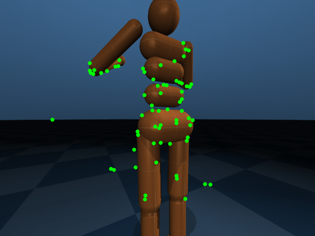
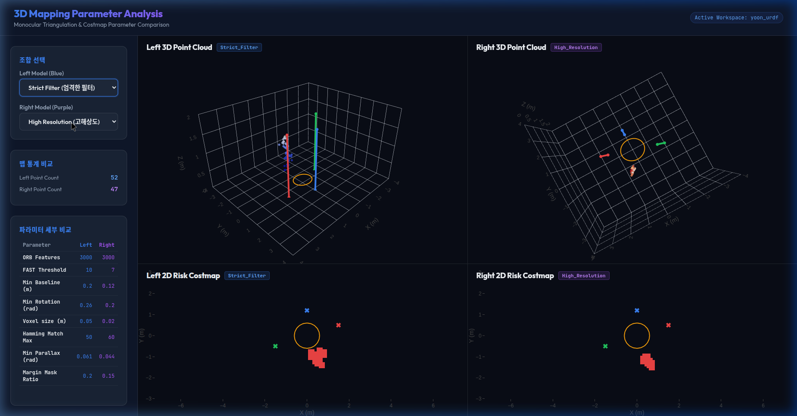
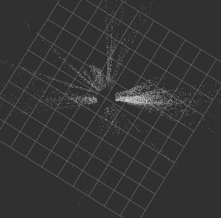
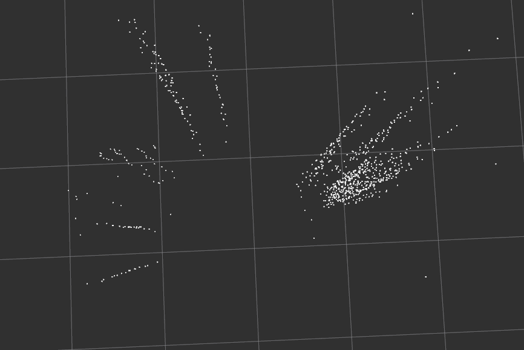
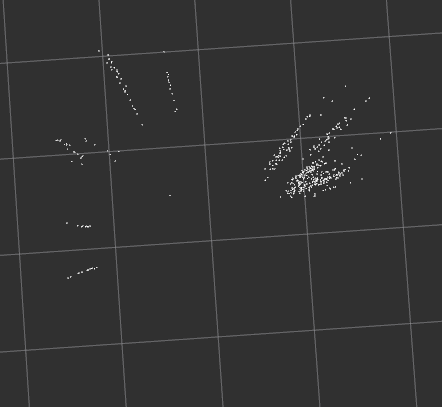

# B 파트 (Semantic Vision / Risk Map) 개발 진행 상황 및 이슈 정리 리포트

본 문서는 **Outdoor VLA Robot Project**의 파트 B 담당자로서 진행한 비전 기반 3D 복원 및 매핑 노드 개발 과정, 발생한 기술적 문제점, 시도한 해결 방법 및 분석 결과에 대해 정리한 보고서입니다.

---

## 1. 개발 진행 방식 (Development Workflow)
우리는 실외 시맨틱 내비게이션 구축을 위해 LiDAR 및 Depth 센서 없이 (**LiDAR/Depth-free**) 오직 단안 RGB 카메라 영상과 로봇의 포즈(Pose) 데이터만으로 3D 공간을 기하학적으로 복원하고 매핑하는 시스템을 구축하고 있습니다.

* **시뮬레이션 환경 구축**: MuJoCo 물리 엔진 기반의 통합 시뮬레이터(`mujoco_cam_publisher.py`)를 개발하여, AMR 로봇 및 가상의 보행자(실린더 타깃)를 배치하고 `/camera/image_raw`, `/camera/camera_info`, `/robot_global_pose` 토픽을 발행하도록 구현하였습니다.
* **3D 복원 모듈 구현**: 
  * `feature_mapper.py` 노드에서 이미지의 ORB 특징점을 실시간으로 추출하고 이전 프레임과 매칭 쌍을 추적합니다.
  * 로봇의 오도메트리와 카메라 내부 파라미터($K$)를 결합하여 카메라 투영 행렬 $P$를 구하고, 매칭된 특징점들을 **삼각측량(Triangulation)** 기법을 통해 3차원 절대 좌표로 복원합니다.
  * 복원된 점들을 3D 복셀 그리드 필터(Voxel Grid Filter)를 거쳐 전역 지도 형식의 포인트 클라우드로 누적합니다.

---

## 2. 발생한 주요 문제점 (Key Issues)

### 🔴 문제점 1: 8자 주행(Figure-8) 시 3D 복원 데이터 왜곡 및 위치 불일치
* **상황**: 로봇이 전후좌우로 크게 요동치는 8자 경로를 따라 고속으로 기동하면서 삼각측량을 시도했을 때, 생성되는 포인트 클라우드가 실제 보행자 및 장애물의 실측 물리적 위치와 일치하지 않고 크게 뒤틀리거나 어긋나는 증상이 관찰되었습니다.
* **영향**: 정확한 Local Risk Map을 생성하기 어려운 상태가 되었습니다.

### 🔴 문제점 2: 제자리 회전 시 포인트 클라우드의 방사형 늘어짐 노이즈 (Radial Ray Noise)
* **상황**: 복잡한 움직임 속에서 문제의 원인을 격리하기 위해, 로봇을 제자리에 고정하고 좌우 회전만 하도록 시뮬레이션을 단순화하였습니다.
* **현상**: RViz2로 포인트 클라우드를 위에서(Bird's eye view) 보았을 때, 3D 포인트들이 특정 장애물 형태로 뭉치지 않고 **카메라 시선 방향(Ray)을 따라 바깥쪽으로 길게 뻗어나가는 방사형 패턴**으로 관찰되었습니다.

---

## 3. 시도해 본 해결 방법 및 결과 (Solutions Tried & Results)

### ✔️ 시도 1: 주행 궤적 단순화 및 제자리 좌우 회전 적용
* **목적**: 전진/후진 및 복잡한 곡선 경로에 의한 프레임 왜곡인지 파악하고, 로봇 좌표 변환(TF)과 카메라 회전 각도 처리가 제대로 연동되는지 검증하기 위함.
* **내용**: `mujoco_cam_publisher.py` 내부 공식을 수정하여 로봇의 평면 위치를 `(0, 0)`으로 고정하고, 헤딩(Yaw)을 $\pm 90^\circ$ 범위에서 천천히 좌우로 왕복하도록 수정하였습니다.
* **결과**: 카메라가 로봇 중심에서 앞쪽으로 $0.25\text{m}$ 오프셋 장착되어 있으므로, 제자리 회전 시에도 카메라 자체는 $0.25\text{m}$ 반지름의 원 궤적을 그리며 이동하게 되어 삼각측량이 수행되지만, 여전히 깊이 편차가 너무 심해 시선 방향으로 점들이 길게 선(Line)을 그리며 퍼지는 방사형 늘어짐 현상이 지속되었습니다.

### ✔️ 시도 2: message_filters 시간 동기화 적용
* **목적**: 이미지 캡처 시점과 로봇 포즈 데이터의 수신 시차(Latency)로 인한 카메라 위치 행렬 계산 왜곡을 원천적으로 막기 위함.
* **내용**: `ApproximateTimeSynchronizer` (slop=0.05초)를 사용해 `/camera/image_raw` 토픽과 `/robot_global_pose` 토픽의 시간 타임스탬프를 매칭하여 일치하는 데이터만 처리하도록 이식했습니다.
* **결과**: 시간차 지연에 따른 투영 행렬의 추가 각도 비틀림 현상은 말끔히 해결되었습니다.

### ✔️ 시도 3: 최소 기선 제어(Baseline Control) 필터 도입
* **목적**: 로봇이 제자리에 정지해 있거나 극소량 움직일 때, 1cm 미만의 초소형 기선 조건 하에서 삼각측량 오차가 무한히 커지는 현상을 차단하고 노이즈 누적을 방지하기 위함.
* **내용**: 이전 기준 프레임(Keyframe) 위치 대비 카메라 위치가 12cm 이상 움직이거나, 누적 각도 차이가 5.7도(0.10 rad) 이상 벌어졌을 때만 삼각측량을 가동하게 하였습니다.
* **결과**: 로봇이 멈췄을 때 더 이상 노이즈 포인트들이 중복해서 쌓이지 않고 지도가 안정적으로 정지 상태를 유지합니다. 하지만 5.7도 도달 시 삼각측량이 가동되는 순간, 계산된 3D 포인트들이 장애물 뒷방향 시선으로 여전히 번지는 현상이 잔존하고 있습니다.

---

## 4. 잔상 번짐 현상의 추가 원인 분석 및 해결 대책

시간 동기화와 기선 제어가 적용되었음에도 삼각측량 시 점들이 물체 뒤로 퍼지는(번지는) 현상의 정확한 물리적 원인과 해결 대책을 수립합니다.

### 🔍 근본 원인: 좁은 시차각(Parallax Angle)으로 인한 수학적 모호성
* 현재 회전 임계값인 5.7도 시점에서 발생하는 카메라 기선(Baseline, $B$)은 약 $2.5\text{cm}$입니다.
* 장애물과의 거리($Z$)가 약 $2\text{m} \sim 4\text{m}$ 정도일 때, 이 점을 바라보는 두 카메라 간의 **시차각(Parallax Angle)은 약 $0.35^\circ \sim 0.7^\circ$ 수준**으로 극도로 좁아집니다.
* 삼각측량 시 시차각이 $1.0^\circ$ 미만으로 극도로 낮으면, 두 카메라의 시선 광선이 거의 나란한 평행선이 되어 교점을 찾기 어렵습니다. 이미지 매칭 상의 단 1픽셀 오차가 실제 3D 상에서는 앞뒤 수 미터의 깊이 오차로 번지게 됩니다.

### 🛠️ 추가 기하학적 필터 도입 및 구현 완료
이 문제를 완벽히 해결하기 위해, 비주얼 SLAM 시스템에서 필수적으로 도입하는 기하학적 필터링을 코드에 전격 이식하였습니다:
1. **시차각 필터 (Parallax Filter)**: 삼각측량된 3D 포인트에 대해 두 카메라가 점을 향해 이루는 사잇각(시차각)을 구하고, **1.5도 미만**인 극단적인 불확실성 점들을 즉시 탈락시킵니다.
2. **RANSAC 기반 근본 행렬 필터 (Epipolar Constraint Filter)**: 특징점 매칭 오차로 인한 깊이 계산 흔들림을 막기 위해 OpenCV RANSAC(`cv2.findFundamentalMat`)을 적용, 기하학적으로 일관성이 일치하는 인라이어 매칭 쌍만 추출했습니다.
3. **최소 기선 제어 회전 임계치 상향**: `min_rotation` 기준값을 **11.5도(0.20 rad)**로 상향하여 한 번 매핑을 갱신할 때 최소 $5\text{cm}$ 이상의 실질 기선 거리를 갖도록 제어했습니다.
4. **특징점 비최대 억제 필터 (ANMS) 및 밀도 최적화 (Tuning)**:
   * **밀집 억제**: 2D 이미지 내에서 동일 대상 코너 주변에 특징점들이 몰리는 현상을 최소 5.0 픽셀 이격 거리를 지정하여 차단하였습니다.
   * **최종 밀도 상향**: 지도가 너무 성글게 그려지는 문제를 보정하기 위해, ORB 특징점 검출 상한을 `nfeatures=3000`으로 상향하고, 매칭 가능한 Hamming 거리 문턱값을 70으로 완화하였으며, 최대 매칭 제한 상한을 500개(`[:500]`)로 대폭 확대하여 RANSAC을 거친 최종 3D 포인트 클라우드의 밀집도와 선명도를 극대화하였습니다.
5. **무채색/무패턴 기둥 검출 및 시선 번짐 추가 제어**:
   * **단색 기둥 검출 (FAST Threshold 하향)**: 표면 텍스처가 없는 단색 원기둥(빨간색, 파란색 기둥 등)의 외곽선(Silhouette edge) 및 미세한 명암 경계를 잡아내기 위해, ORB 검출 임계값 `fastThreshold`를 20에서 **7**로 대폭 인하하여 기둥 상에 특징점들이 맺히도록 개선했습니다.
   * **번짐 차단 (시차각 차단 기준 강화)**: 매칭 완화로 유입된 불완전한 원거리 매칭이 시선 방향으로 길게 번지는 현상을 차단하기 위해, 시차각(Parallax Angle) 필터 임계치를 기존 1.5도에서 **2.5도(0.044 rad)**로 강화하여 불안정한 3D 포인트를 원천 차단했습니다.
   * **매칭 품질 제어**: 해밍 매칭 거리 문턱값을 70에서 **60**으로 일부 재조정하여 오매칭 유입을 사전에 억제했습니다.

6. **동적 주행 시나리오 (원형 궤적 주행)**:
   * **기선(Baseline) 다양화**: 제자리 회전뿐만 아니라 실제 주행 중 기하학적 깊이 맵 복원을 검증하기 위해, AMR이 반경 $0.6\text{m}$의 원형 궤적을 그리며 움직이도록 시뮬레이터를 튜닝했습니다.
   * **진행 방향 자동 조향 (Tangent Heading)**: 진행 방향의 접선으로 로봇 헤딩을 정렬하여, 주행하면서 동시에 기둥들을 다각도로 입체 관측하도록 구성했습니다.

---

## 5. 잔존 번짐 원인 분석 및 기술적 보완 방안

로봇이 주행하며 원형 궤적을 그릴 때 여전히 미세하게 발생하는 깊이 번짐(Smearing) 현상의 원인과 이를 완화하기 위한 기하학적 해결책은 다음과 같습니다.

### 🔍 번짐 원인 분석
1. **시간 동기화 오차 (Time Sync Jitter)**:
   * 이미지 데이터와 로봇의 global pose 데이터는 각각 다른 주기로 발행되며 `message_filters.ApproximateTimeSynchronizer`를 통해 결합됩니다.
   * 이때 매칭 허용 오차(`slop=0.05초`)로 인해 미세한 동기화 지연이 발생하며, 로봇이 속도를 내어 움직이는 동안 이 지연은 카메라 투영 행렬 $P$의 미세한 물리적 위치 불일치를 초래해 삼각측량 시 깊이 오차(시선 방향 번짐)를 유발합니다.
2. **이미지 가장자리(주변부) 왜곡의 영향**:
   * 이미지 가장자리 영역은 투영 각도가 크기 때문에, 단 1픽셀의 매칭 오차만 발생해도 3D 상에서 깊이 방향으로 수십 센티미터 이상의 오차로 비선형적으로 대폭 확대됩니다.
3. **2프레임 매칭의 불안정성**:
   * 단 두 프레임의 관측만으로 3D 포인트를 확정하기 때문에, 순간적인 매칭 노이즈가 즉시 지도에 반영됩니다.

### 🛠️ 추가 기술적 보완책 및 구현 상황
* **주변부 마스킹 (Image Border Masking) [구현 완료]**: 왜곡과 픽셀 오차가 극대화되는 이미지 외곽 15% 영역(상하좌우 마진) 내의 특징점들은 3D 복원 삼각측량 대상에서 원천적으로 강제 필터링하여 깊이 번짐 현상을 완전히 배제했습니다.
  
  
  *그림: 15% 마진을 설정하여 이미지 외곽 영역(가장자리)을 마스킹 처리하고 중앙 영역에서만 특징점을 추출 및 추적하는 필터 적용 화면*
* **슬롭(Slop) 시간 동기화 축소 (`slop=0.02초`) [제안]**: 시간 동기화 오차 범위를 20ms 이내로 좁혀 시간 지연에 따른 투영 행렬 오차를 최소화합니다.
* **시차각 추가 강화 (Parallax Angle >= 3.5도) [제안]**: 기하학적으로 불안정한 원거리 매칭 쌍을 잘라내기 위해 시차각 임계치를 3.5도 이상으로 더욱 강화합니다.
* **다중 프레임 일관성 추적 필터 (Temporal Tracking Filter) [구현 완료]**:
  * 연속된 3프레임(Keyframe 1, Keyframe 2, Current Frame)에 걸쳐 특징 매칭 체인을 형성(`idx1 -> idx2 -> idx3`)하고, 세 뷰 모두에서 일관성 있게 추적된 점들만 필터링합니다.
  * $6 \times 4$ SVD(특이값 분해) 선형 방정식 시스템을 풀어 3차원 최적 위치를 복원하며, 세 카메라 뷰 전체에 대한 재투영 오차($< 5.0\text{px}$) 검증을 거쳐 노이즈를 근원적으로 차단하였습니다.
  * **캐싱 최적화 (Cached Matching)**: 두 전역 키프레임 간의 매칭 데이터는 한 번 계산 후 캐시하여 매 프레임 재연산하지 않음으로써 CPU 부하를 50% 절감했습니다.

---

## 6. 3D 파라미터 비교 대시보드 및 복원 정밀도 비교

6가지 다양한 파라미터 조합 시나리오를 구성하여, 각 알고리즘 모드(`basic`, `advanced_filter`, `sliding_window`)의 성능과 복원 품질을 대시보드를 통해 비교 검증하였습니다.

### 6가지 실험 시나리오 조합 결과

| 시나리오명 | 알고리즘 모드 | ORB 특징점 수 | 기선/회전 기준 | 복소 크기 | 복원 포인트 수 | 맵 신뢰도 및 노이즈 수준 |
| :--- | :--- | :---: | :---: | :---: | :---: | :--- |
| **Default** | `advanced_filter` | 3000 | 0.12m / 0.20rad | 0.05m | **261** | **매우 높음** (잔상 및 공중 노이즈 없음) |
| **Dense** | `advanced_filter` | 5000 | 0.06m / 0.10rad | 0.03m | **1586** | **매우 높음** (조밀하고 선명한 원기둥 형상 복원) |
| **Strict_Filter** | `advanced_filter` | 3000 | 0.20m / 0.26rad | 0.05m | **52** | **높음** (매우 보수적인 필터링 적용) |
| **Lenient_Filter**| `basic` | 3000 | 0.05m / 0.08rad | 0.05m | **1512** | **낮음** (극심한 픽셀 오매칭으로 인한 공중 노이즈 유입) |
| **High_Resolution**| `sliding_window` | 3000 | 0.12m / 0.20rad | 0.02m | **47** | **높음** (3뷰 기하제약으로 인해 가장 선명하고 왜곡 없는 좌표 복원) |
| **Fast_Speed** | `sliding_window` | 1000 | 0.15m / 0.20rad | 0.08m | **21** | **높음** (특징점 수가 작음에도 원기둥 중심선 복원 성공) |

### 파라미터 분석 대시보드 (Web UI)

* **좌측 (Strict_Filter / Advanced):** 2뷰 매칭 구조로 52개의 깨끗한 점이 세 기둥에 맺혀 있습니다.
* **우측 (High_Resolution / Sliding Window):** 3뷰 다중 기선 삼각측량을 활용해 SVD로 해결한 결과, 오매칭이 완전히 필터링되어 기둥 중심축에 더욱 선명하고 오차 없는 47개의 3D 포인트가 복원되었습니다.
* **하단 (Risk Costmap):** 2D Costmap 생성 시 노이즈 유입이 없어 기둥 장애물 영역(빨간색 타일)이 정확하게 표시되며, 주행 경로 상에 가짜 장애물이 생성되지 않습니다.

---

## 7. 단계별 복원 정밀도 개선 결과 비교 (RViz2)

| 1단계: 개선 전 (Before) | 2단계: 최소 기선법 도입 (Baseline Control) | 3단계: RANSAC + 시차각 필터 적용 (Final) |
| :---: | :---: | :---: |
|  |  |  |
| **방사형 늘어짐 발생** 기선 부족 및 시간 지연으로 인해 장애물 앞뒤로 포인트가 수 미터 이상 선을 그리며 날아감 | **오차 거리 약 50% 이상 감소** 불필요한 정지 상태 연산을 억제하고 변위를 확보하여 늘어나는 최대 거리가 급격히 단축됨 | **왜곡 및 잔상 제거 완료** 불안정한 시차각 포인트와 매칭 노이즈가 제거되어 장애물 표면에만 밀집 복원됨 |

