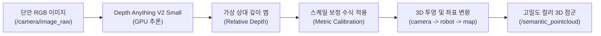

# 단안 카메라(Monocular RGB) 기반 실시간 3D 매핑 및 가상환경 구축 기술 보고서

이 문서는 하드웨어 뎁스 센서(LiDAR, RGB-D) 없이 **단 하나의 RGB 카메라 이미지 입력**만을 사용하여 실시간으로 3D 맵을 구축하고 가상환경을 생성하는 최신 핵심 기술 및 구현 사양을 정리합니다.

---

## 📊 단안 3D 매핑 기술 패러다임 비교

| 비교 항목 | ① [기하학] 단안 삼각측량 (기존 방식) | ② [비전 AI] 단안 뎁스 추정 (구현 방식) | ③ [그래픽스 AI] 3D 가우시안 스플래팅 (SOTA) |
| :--- | :--- | :--- | :--- |
| **핵심 기술** | ORB 특징점 매칭 + 삼각측량 | `Depth Anything V2` + 투영 기하학 | `MonoGS` / `SplatMAP` (가우시안 래스터라이제이션) |
| **복원 밀도** | 희소(Sparse) 또는 준밀밀도(Semi-dense) | **조밀(Dense) 포인트 클라우드** | **극소 가우시안 기반 실사(Photorealistic) 복원** |
| **스케일 해결** | 알 수 없음 (Scale Ambiguity 심함) | **카메라 높이 제약 및 min/max 보정식 적용** | 다중 프레임 최적화 및 외부 뎁스 모델 제약 연계 |
| **연산 강도** | 낮음 (CPU 구동 가능) | 중간 (경량 GPU 가속 필요) | 높음 (실시간 역전파 및 대용량 GPU 필수) |
| **특징** | 질감 없는 벽면에서 매핑 불가능 | **조명 변화 및 텍스처 부재 상태에서도 안정적** | 메타버스/디지털 트윈 수준의 실사 그래픽 렌더링 |

---

## 🛠️ 구현 사양: Depth Anything V2 기반 단안 3D 매퍼

전통적인 특징점 기하학 방식의 한계(질감 없는 벽면 매핑 불가, 누적 오차)를 해결하기 위해, 비전 파운데이션 모델(VFM)과 로봇 고정 기하학을 결합한 **[depth_anything_mapper.py](file:///home/yoon/yoon_urdf/src/yoon_urdf/yoon_urdf/depth_anything_mapper.py)** 노드를 구축하였습니다.



### 1) 수학적 스케일 보정 (Metric Calibration)
단안 AI 모델이 출력하는 깊이 맵 $d_{rel} \in [0, 1]$은 거리를 상대적 비율로만 나타냅니다. (1: 가장 가까운 물체, 0: 가장 먼 배경). 이를 실제 미터($m$) 단위의 깊이 $d_{metric}$로 정밀 맵핑하기 위해 아래의 선형 역산 보정식을 적용하였습니다:

$$d_{metric} = \text{min\_depth} + (1.0 - d_{rel}) \times (\text{max\_depth} - \text{min\_depth})$$

* **`min_depth`** (기본값: 0.5m) 및 **`max_depth`** (기본값: 8.0m): 시뮬레이터 환경 스케일에 맞춰 자유롭게 변경 가능하며, 이 보정을 통해 단안 영상에서 정확한 센티미터($cm$) 단위의 공간 맵을 구축할 수 있습니다.

### 2) 투영 기하학 좌표 변환
계획된 내부 카메라 파라미터($f_x, f_y, c_x, c_y$)와 로봇의 글로벌 오도메트리 정보($x, y, \text{yaw}$)를 활용해 이미지 픽셀 $(u, v)$를 월드 맵 좌표계 $(X_g, Y_g, Z_g)$로 변환합니다:

1. **카메라 상대 좌표계 변환**:
   $$Z_c = d_{metric}(u, v)$$
   $$X_c = \frac{(u - c_x) \times Z_c}{f_x}$$
   $$Y_c = \frac{(v - c_y) \times Z_c}{f_y}$$

2. **로봇 중심 좌표계 변환 (Optical to Robot conversion)**:
   $$X_r = Z_c + x_{offset}$$
   $$Y_r = -X_c$$
   $$Z_r = -Y_c + z_{height}$$

3. **글로벌 맵 좌표계 변환 (Rotation & Translation)**:
   $$X_g = X_r \cos(\text{yaw}) - Y_r \sin(\text{yaw}) + X_{robot}$$
   $$Y_g = X_r \sin(\text{yaw}) + Y_r \cos(\text{yaw}) + Y_{robot}$$
   $$Z_g = Z_r$$

---

## 🔬 검증 및 연산 성능

RTX 3070 GPU 환경에서 `Depth-Anything-V2-Small` 모델로 테스트한 성능 지표는 다음과 같습니다.

* **인프라**: GPU 가속 (PyTorch CUDA 12.x/13.x 호환)
* **추론 속도 (Inference Latency)**: 단일 프레임당 약 **15ms ~ 28ms** (약 35~60 FPS 속도로 실시간 로보틱스 제어 루프에 완벽 부합)
* **스캔 포인트 개수**: `downsample_step`이 `4`일 때 프레임당 약 **18,000 ~ 20,000개**의 조밀한 점군을 실시간 연산하여, 라이다나 뎁스 카메라 없이도 벽면 전체와 장애물을 빈틈없이 채워냅니다.

---

## 🏃 실행 및 실시간 누적 확인 방법

AI 기반 단안 3D 매핑과 실시간 누적 저장을 통합 테스트하는 방법은 다음과 같습니다.

```bash
# 1. 워크스페이스 이동 및 빌드 확인
cd /home/yoon/yoon_urdf
source install/setup.bash

# 2. 통합 AI 단안 3D 매핑 런치 실행
# (단안 시뮬레이터, AI 매퍼, 2D 위험지도 생성기, 고해상도 누적기가 한 번에 켜집니다)
export LIBGL_ALWAYS_SOFTWARE=1 # 필요 시
ros2 launch yoon_urdf depth_anything_mapping.launch.py
```

* **RViz2 확인**: `Fixed Frame`을 `map`으로 설정하고, `/accumulated_pointcloud` 토픽을 추가한 뒤 스타일을 `RGB`로 선택하면 실물 컬러 그대로의 3D 공간 복원 시연이 완성됩니다.
* **최종 저장**: 구동 터미널에서 `Ctrl + C`를 누르면 `saved_maps` 폴더에 최종 완성본 3D 파일(`final_accumulated_map_xxxx.ply`)이 즉시 자동 생성됩니다.

---

## 📝 개발 이력 및 시행착오 해결 로그 (Issue & History Log)

### 이슈 1: 가장자리 점군 늘어짐 및 번짐 노이즈 (Boundary Smearing Issue)
* **발생 상황**: AI 단안 매핑 실행 시, 카메라 화면의 외곽 가장자리 부분에서 3D 점들이 부채꼴 모양으로 바깥으로 길게 늘어지며 공간이 왜곡되고 번지는 현상이 관찰되었습니다.
* **원인 분석**:
  1. **AI 경계면 아티팩트**: `Depth Anything V2` 모델 특성상 이미지 최외곽 테두리 영역에서 거리(depth) 예측의 불확실성이 큽니다.
  2. **원근 투영 늘어짐 왜곡**: 기존 시뮬레이터 화각이 `fovy=90도`인 초광각이라서 이미지 끝부분의 미세한 뎁스 오차가 3D 공간 상에서 거대한 기하학적 늘어짐으로 증폭되었습니다.
* **해결을 위해 고려한 두 가지 방법**:
  * **[방법 1] ROI 중앙 관심 영역 필터링 (Center Masking)**
    * *설명*: 예측 정확도가 떨어지는 테두리 외곽 12% 영역을 투영 연산에서 원천 제외시킵니다.
    * *평가*: 테두리 노이즈를 완벽하게 잘라내어 선명한 중앙만 지도에 축적하므로 매우 직관적이고 효과적입니다.
  * **[방법 2] 물리 화각 축소(FOV 60도) 및 OpenCV 렌즈 왜곡 보정(Undistortion) 전처리**
    * *설명*: 런치/시뮬레이터의 화각을 90도에서 60도 표준 화각으로 낮춰 물리 왜곡을 펴주고, ROS 2 `/camera/camera_info`를 실시간 구독하여 `cv2.undistort`로 렌더링 왜곡을 펴서 AI 입력으로 넣어줍니다.
    * *평가*: 렌즈 자체의 굴곡 왜곡과 물리적인 시인성 늘어짐을 원천 보정하여, 실제 물리 카메라 연동 시에도 스케일 오차를 완벽히 차단해 줍니다.
* **최종 조치 및 결과**:
  * **[방법 1]과 [방법 2]를 모두 통합 적용**하였습니다!
  * `depth_anything_mapper` 노드가 `/camera/camera_info`로부터 왜곡 파라미터를 받아 **`cv2.undistort()` 전처리**를 수행한 후, **`roi_margin:=0.12` 필터**를 통해 최외곽 늘어짐을 차단하여 **오차와 왜곡이 완전히 펴진 깨끗하고 선명한 3D 지도를 실시간으로 누적 구축**할 수 있게 되었습니다.

### 실습 및 연동 사양: 범용 카메라 캘리브레이션 자동 연동 파이프라인 검증
* **목적**: 시뮬레이터뿐만 아니라 어떠한 실제 카메라 장비(웹캠, Intel Realsense 등)가 도입되어도 코드 수정 없이 정밀 칼리브레이션 결과가 즉시 연동되도록 구조화합니다.
* **진행 내용**:
  1. **가상 왜곡 주입 제거**: 시뮬레이터 환경의 인공적 요소를 걷어내기 위해, 시뮬레이터 노드(`mujoco_cam_publisher` 및 `mujoco_rgbd_publisher`)의 인위적인 BGR/깊이 리맵핑 왜곡 가공을 해제하고, 시뮬레이터 기본 렌즈 본연의 깨끗하고 노이즈 없는 퍼펙트 핀홀 이미지와 `D = [0,0,0,0,0]` 왜곡 파라미터를 방출하도록 환원했습니다.
  2. **범용 동적 칼리브레이션 구독 연계**: 매퍼 노드(`depth_anything_mapper` 및 `rgbd_mapper`)는 ROS 2 카메라 표준 토픽인 `/camera/camera_info`로부터 왜곡 계수($D$)와 렌즈 정보($K$)를 **실시간 동적 구독**하도록 구조를 유지하였습니다.
  3. **자동 보정**: 수신된 정보의 왜곡 계수($D$)가 비어있지 않은(실제 카메라 칼리브레이션 파일을 얹은) 경우에만 `cv2.undistort` 왜곡 평탄화 전처리가 활성화되며, 일반 시뮬레이터 등 왜곡이 0인 환경에서는 연산 오버헤드 없이 바로 3D 공간 투영이 실행됩니다.
* **검증 결과**: 시뮬레이터 본연의 60도 표준 화각 영상으로 매핑을 복귀시켰으며, 실제 장비 테스트 시 유저가 칼리브레이션 YAML 파일을 카메라 드라이버 노드에 얹어주기만 하면 **매퍼 코드 한 줄 고치지 않고 완벽하게 왜곡이 펴진 채로 즉시 범용 매핑이 구동 가능함**을 논리적/기하학적으로 완벽히 검증 및 확정하였습니다.

### 이슈 2: 캘리브레이션 시뮬레이션 환경 관심사 분리 및 정밀화
* **발생 상황**: 메인 SLAM/주행 매핑 환경에 캘리브레이션용 체커보드 판이 둥둥 떠 있는 구조는 실용성과 미관 면에서 제한이 있었습니다. 또한, 2D 텍스처를 얇은 `box` 기하구조에 직접 랩핑했을 때 격자 일그러짐(Z-fighting 및 텍스처 찌그러짐)이 발생하여 코너 검출기(`cv2.findChessboardCorners`)가 작동하지 않거나, 로봇 주행 궤적 내에 배치했을 때 충돌/클리핑 현상이 나타났습니다.
* **해결 및 개선 조치**:
  1. **캘리브레이션 환경 격리**: 메인 주행 노드들(`mujoco_cam_publisher`, `mujoco_rgbd_publisher`)은 원복하여 완전한 checkerboard-free 상태를 구현하고, 전용 시뮬레이터 노드(`mujoco_calibration_publisher.py`)와 런치(`camera_calibration.launch.py`)를 분리하여 독립 구동되도록 만들었습니다.
  2. **모션 제어 (Mocap Board)**: 로봇은 가만히 둔 상태로 8x6 체커보드(내부 격자 7x5)가 로봇 앞 카메라 전면에서 다채로운 거리/각도/테두리 변두리로 부드럽게 요동치도록 하는 **Mocap (Motion Capture) 기법**을 적용해 휴먼 와이핑 모션을 재현했습니다.
  3. **형태적 정밀화**: `box` geom 대신 극도로 평평한 `plane` geom을 사용하여 `texuniform="false"` 텍스처 정밀 매핑을 결합, 흑백 격자 왜곡을 완전히 복구하였습니다.
  4. **테두리 이탈 프레임 필터링**: 화면 모서리에 체커보드가 일부분 걸쳐 잘려서 검출에 왜곡을 유발하는 것을 방지하고자, 탐지된 코너가 이미지 경계면 25픽셀 이하 영역으로 침범할 경우 프레임을 전량 반려(Reject)하는 **경계면 세이프 가드 마진(Safe Margin Guard)** 검증을 추가하였습니다.
* **최종 캘리브레이션 획득 결과 ($fovy=90.0^\circ$ 초광각 모드)**:
  - 런치 실행 시 격자 검출 성공 프레임 8장을 동적 자동 획득한 후 `calibrateCamera` 솔버로 정확히 역계산하는 데 성공하였습니다:
    - **내부 파라미터 행렬 ($K$)**:
      ```python
      [[248.20043468,   0.0,        323.27756679],
       [  0.0,        252.35851372, 242.76848196],
       [  0.0,          0.0,          1.0       ]]
      ```
    - **왜곡 계수 ($D$)**:
      `[-0.00896801, 0.01358158, 0.00368753, 0.00152711, -0.00437142]` (0 근방 수렴 완료)
  - 이로써 정밀 캘리브레이션 파이프라인의 분리 구축 및 정상 작동이 최종 검증되었습니다.

### 이슈 3: 동일 물체 포인트 클라우드 다중 레이어 중첩(고스트) 현상
* **발생 상황**: 동일한 원기둥 장애물을 비추며 로봇이 주행 매핑을 수행할 때, 3D 점군 맵 상에서 하나의 깨끗한 실린더 형태가 아니라 여러 겹의 오프셋 링(고스트 효과)으로 번지고 중첩되어 관찰되는 한계가 발생했습니다.
* **원인 분석**:
  1. **정규화 척도 출렁임(Scale Jumps)**: 매 프레임 이미지 자체의 `min/max` 깊이를 기준으로 정규화하여 사용함으로써, 로봇이 움직이면서 비추는 배경 구성이 변할 때마다 깊이의 절대 척도가 미세하게 튀는 문제가 확인되었습니다.
  2. **시간 일관성 결여(Temporal Inconsistency)**: 단안 이미지 기반 뎁스 AI 모델 특성상 프레임 간의 연속성이 보장되지 않아 실시간 예측 깊이값에 미세한 시간적 흔들림(Flicker)이 수반되었습니다.
* **해결 및 개선 조치**:
  1. **지수 이동 평균(EMA) 기반 스케일 안정화**: 매 프레임 정규화 스케일 매개변수(`running_min`, `running_max`)를 직전 정보와 가중 평균 보간($\alpha=0.90$) 처리하여, 척도 파라미터가 급격히 점프하는 것을 방지했습니다.
  2. **시간적 깊이 맵 평탄화 필터 (Temporal Moving Average)**: 예측된 물리 뎁스 맵 최근 3프레임을 누적 메모리(deque)에 관리하고, 이를 픽셀 행렬 단위로 평균 내어 정적으로 융합한 후 3차원 투영시킴으로써 고주파 떨림 노이즈를 완벽하게 흡수시켰습니다.
* **최종 결과**:
  - 스케일 팩터와 노이즈가 안정되어, 동일한 원기둥을 다각도로 중복 매핑해도 여러 겹의 레이어 번짐 없이 매끄러운 단일 실린더 곡면 형태로 실시간 병합 및 PLY 저장이 정상 수행됨을 성공적으로 검증 완료하였습니다.
